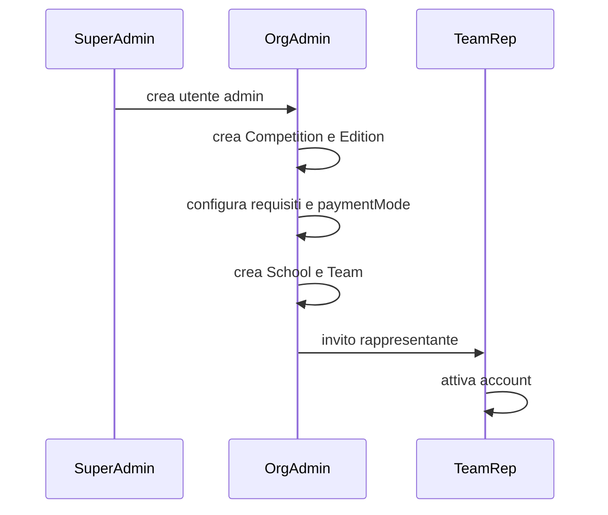
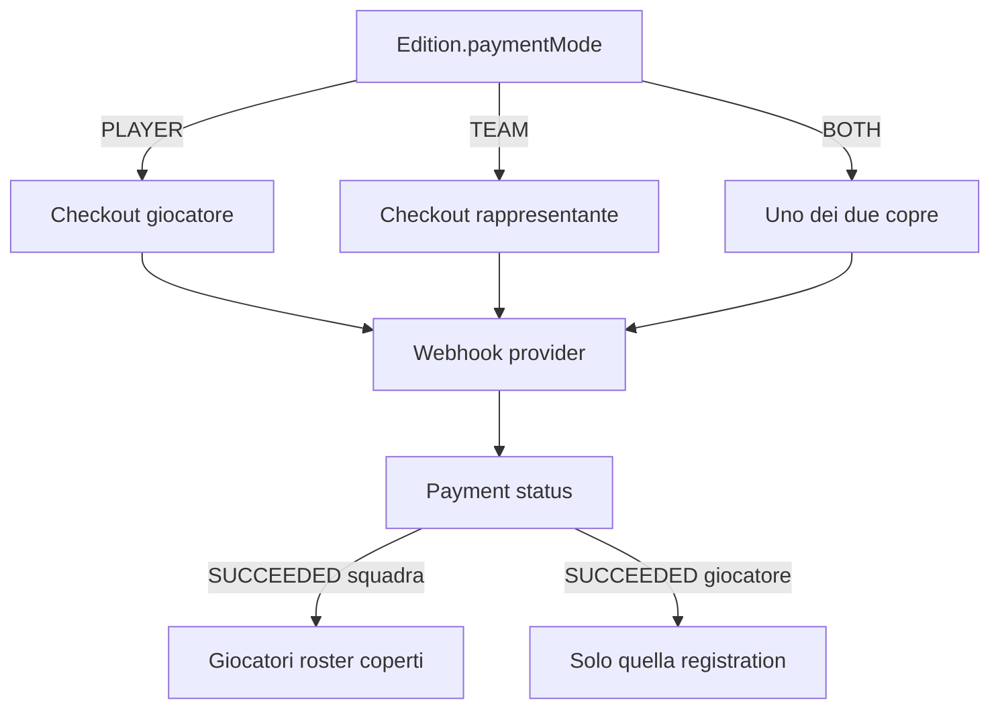

# 04 — User Flows

## 1. Bootstrap organizzazione (pre-giocatore)



## 2. Invito giocatore (ingresso unico v1)

```mermaid
sequenceDiagram
  participant TR as TeamRep
  participant Sys as Hub
  participant P as Player
  TR->>Sys: crea PlayerInvite (email, team, dati roster minimi)
  Sys->>P: email con link token (quando adapter live; in M1 stub: link una tantum al rappresentante)
  P->>Sys: apre /invito/[token] (o incolla il link su /invito)
  alt token valido e email nuova
    P->>Sys: crea account proprio (email+password)
    Sys->>Sys: User PLAYER, Membership, Registration ACCOUNT_CREATED, emailVerified
  else email già registrata
    P->>Sys: login obbligatorio, poi conferma collegamento (niente takeover password)
  else token invalido/scaduto/usato/revocato
    Sys->>P: errore chiaro, niente account
  end
```

Regole:

- Un invito è legato a **un’email** e **un team/edizione**.
- Non esiste registrazione senza token valido.
- Se l’email ha già un account, il redeem collega membership/registration senza creare un secondo user (dettaglio conflitti in OPEN_DECISIONS se già iscritto ad altra edizione).

## 3. Percorso giocatore (post-M0)

Passi guidati, uno schermo alla volta, salvataggio per passo:

1. Dati personali
2. Genitore/tutore **solo se minore** (inserito automaticamente in base alla data di nascita)
3. Certificato medico
4. Privacy / informative trattamento
5. Liberatorie foto/video/social (step evidenziato)
6. Pagamento (se dovuto al giocatore)
7. Riepilogo e “cosa succede ora”

L’utente può uscire e riprendere. La dashboard mostra sempre il prossimo passo.

## 4. Minore

1. Data di nascita → `isMinor = age < 18` (assunzione, da validare).
2. Se minore, il passo guardian è obbligatorio per avanzare.
3. Consensi con audience `GUARDIAN` / `MINOR` mostrati con copy dedicato (placeholder legale).
4. Il login resta del minore. Il genitore riceve comunicazioni sulla propria email quando l’adapter è live.
5. Non si afferma che il click digitale del minore o del genitore abbia valore legale: tracciamo acceptance; la validità è OPEN_DECISIONS.

## 5. Documento medico

1. Upload (PDF/JPEG/PNG, limite size — valori in config, default proposto 10 MB).
2. Validazione MIME reale + estensione; virus scanning è OPEN_DECISIONS.
3. Metadata persistiti; blob privato.
4. Stato `UPLOADED` / `PENDING_REVIEW`.
5. Admin apre via signed URL (TTL breve), audit `DOCUMENT_VIEW`.
6. Approve oppure reject + motivo obbligatorio → giocatore vede CTA “carica di nuovo”.
7. Replace: il documento precedente passa a `REPLACED`, non si perde la storia.

Il rappresentante vede solo lo stato, mai l’URL.

## 6. Review organizzazione

Admin lista registrazioni filtrabili per edizione, squadra, stato.

- `PENDING_REVIEW` quando i requisiti “di contenuto” sono soddisfatti e resta la revisione umana (certificato).
- `CHANGES_REQUESTED` se un requisito è rifiutato.
- `APPROVED` quando tutti i requisiti required sono ok **e** il pagamento dovuto è coperto.

## 7. Pagamento



Nessun dato carta nel nostro DB. Il ritorno utente e il webhook devono essere idempotenti.

## 8. Correzioni

Se l’admin chiede modifiche:

- Dashboard: stato `CHANGES_REQUESTED` + elenco voci da correggere con motivo.
- Il giocatore modifica solo ciò che è richiesto (e può sempre aggiornare documenti rifiutati).
- Non si resetta l’intera iscrizione.

## 9. Comunicazioni

Eventi (da notificare in-app; email quando provider scelto): invito, account creato, documento rifiutato, pagamento riuscito/fallito, iscrizione approvata, reminder requisiti mancanti.

I template hanno placeholder e non includono CF o link firmati lunghi in chiaro oltre il necessario.
