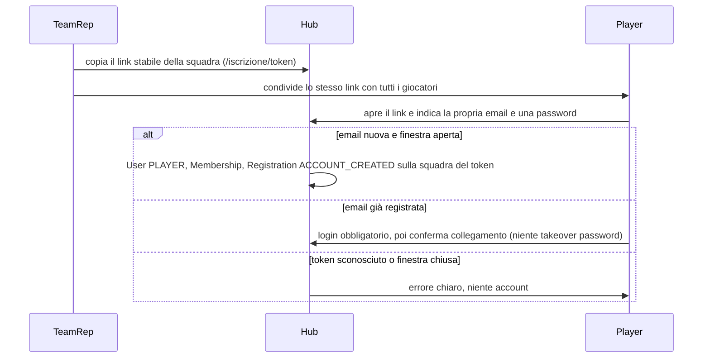
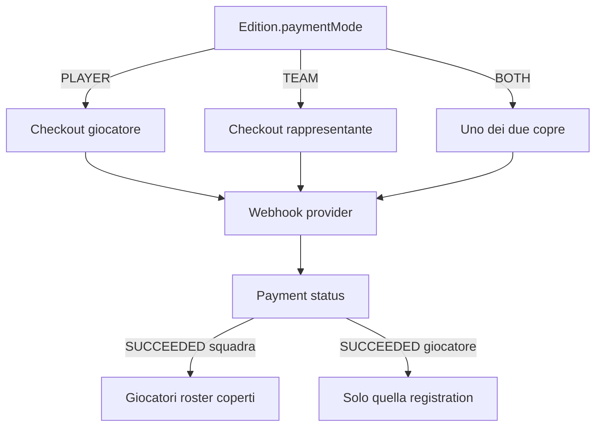

# 04 — User Flows

## 1. Bootstrap organizzazione (pre-giocatore)

```mermaid
sequenceDiagram
  participant SA as SuperAdmin
  participant OA as OrgAdmin
  participant Sys as Hub
  participant TR as TeamRep
  SA->>OA: crea utente admin
  OA->>OA: crea Competition e Edition
  OA->>OA: configura requisiti e paymentMode
  OA->>OA: crea School e Team
  OA->>TR: StaffInvite (email, team, token hashato)
  TR->>Sys: apre /invito-staff/[token]
  TR->>TR: crea o collega account; ruolo TEAM_REPRESENTATIVE; niente Registration
```

## 2. Link di iscrizione della squadra (ingresso unico v1)

```mermaid
sequenceDiagram
  participant TR as TeamRep
  participant Sys as Hub
  participant P as Player
  TR->>Sys: copia il link stabile della squadra (/iscrizione/token)
  TR->>P: condivide lo stesso link con tutti i giocatori
  P->>Sys: apre il link e indica la propria email e una password
  alt email nuova e finestra aperta
    Sys->>Sys: User PLAYER, Membership, Registration ACCOUNT_CREATED sulla squadra del token
  else email già registrata
    P->>Sys: login obbligatorio, poi conferma collegamento (niente takeover password)
  else token sconosciuto o finestra chiusa
    Sys->>P: errore chiaro, niente account
  end
```

Regole:

- Un link per squadra (`Team.registrationToken`), non un invito per calciatore.
- L’email è del giocatore, raccolta nel form di iscrizione, e resta collegata a User, membership e `Registration.teamId`.
- Non esiste registrazione senza quel token e senza finestra iscrizioni aperta.
- Se l’email ha già un account, il redeem collega membership/registration senza creare un secondo user.
- `PlayerInvite` per singolo giocatore non è più il percorso di ingresso. `StaffInvite` resta personale.

## 3. Percorso giocatore (post-M0)

Passi guidati, uno schermo alla volta, salvataggio per passo. L’account si crea dal link di squadra; l’email va verificata **prima** di anagrafica, consensi, upload e pagamento.

### Maggiorenne

1. Verifica email
2. Dati personali e controllo età
3. Informative e condizioni necessarie (T1, presa visione, casella salute M3)
4. Upload del certificato
5. Revisione del file da `MEDICAL_REVIEWER` (o Super Admin)
6. Liberatorie per canale (M7–M11)
7. Marketing separato (M4/M5/M6)
8. Pagamento (se dovuto al giocatore)
9. Riepilogo e email di riepilogo

### Minorenne (account del minore)

1. Verifica email
2. Dati personali e controllo età
3. Contatti del genitore (nome, cognome, email, telefono; altro genitore o unico esercente come **dato inserito**, non come autorizzazione)
4. Lettura delle informative (senza chiudere gli atti riservati al genitore)
5. Upload del certificato (la revisione resta allo staff)
6. Assenso immagini G14 (dai 14 anni), sull’account del minore
7. Pagamento solo **dopo** l’autorizzazione di iscrizione del genitore
8. Riepilogo: dati del minore, atti del minore, attesa o esito del genitore

Il wizard del minore **non** registra G1, G2, G4, G5–G13 né marketing. Quelle caselle le compie il genitore sul link. Il frontend non è una barriera: le server action rifiutano la sessione del minore.

L’utente può uscire, **aprire ogni passo dalla dashboard** e riprendere. Dopo i dati personali, i passi successivi (incluso il certificato ancora da caricare) sono navigabili, salvo i gate server. La dashboard mostra il progresso **N/M completati** e il prossimo passo **finché** restano voci da fare o in attenzione. Se lo stato è `APPROVED` o `WITHDRAWN`, o la checklist è completa, non c’è CTA “Continua” verso il wizard.

Fuori dalla finestra `registrationOpensAt`/`registrationClosesAt`: il link di squadra non crea nuovi account, e scritture wizard e checkout sono bloccati.

## 4. Minore e autorizzazione del genitore

1. Data di nascita → `isMinor = age < 18` (assunzione, da validare).
2. Il passo tutore salva solo il contatto e apre una `GuardianAuthorization` `PENDING`. Email del genitore uguale a quella del minore, e nome-cognome identici al minore, sono rifiutati.
3. Il sistema invia al contatto un’email di **richiesta di autorizzazione** (non una copia delle email del minore) con token crittografico, hashato, con scadenza, senza PII nel token.
4. La pagina `/autorizzazione-genitore/[token]` mostra minore, torneo, finalità, documenti della versione corrente, trattamento del certificato, liberatorie distinte. Il genitore dichiara il ruolo (G1) e compie gli atti. Ogni scelta è un atto del `guardianId`, non del `userId` del minore.
5. `GUARDIAN_IF_MINOR` e `PRIVACY` (percorso minore) sono completi solo con autorizzazione `ENROLLMENT` in stato `AUTHORIZED`. Senza, niente `APPROVED` e niente checkout giocatore.
6. Se il contatto indica un altro genitore, il secondo riceve un link `PUBLICATION` (evoluzione di C1) per foto/video e cognome completo. Per giocare basta l’atto del contatto principale. Se anche l’iscrizione richieda entrambi: **DA VALIDARE LEGALMENTE**.
7. G14 resta l’assenso del minore dai 14 anni, distinto dall’autorizzazione del genitore.
8. Revoca: link dedicato `/revoca-genitore/[token]` senza login del minore. Lo storico precedente resta. Notifica interna con i canali da ritirare. La rimozione da social esterni resta organizzativa (OD-031).
9. Non si introduce SPID, CIE o upload di documento d’identità. Non si afferma che il click abbia valore legale: OD-002 resta aperto.

## 5. Documento medico

1. Upload (PDF/JPEG/PNG, limite size — valori in config, default proposto 10 MB).
2. Validazione MIME reale + estensione; virus scanning è OPEN_DECISIONS.
3. Metadata persistiti; blob privato.
4. Stato `UPLOADED` / `PENDING_REVIEW`.
5. Solo `MEDICAL_REVIEWER` e Super Admin aprono il file via signed URL (TTL breve), audit `DOCUMENT_VIEW`. Org Admin e rappresentante vedono lo stato.
6. Approve oppure reject + motivo obbligatorio (incluso «contenuto sanitario eccedente il certificato richiesto») → giocatore vede CTA “carica di nuovo”.
7. Replace: il documento precedente passa a `REPLACED`. Il blob sostituito o rifiutato si cancella dallo storage; la riga di esito resta (`blobPurgedAt`).
8. A 90 giorni da `Edition.endsAt` (e in anticipo sul ritiro) il job di retention cancella il file approvato e conserva l’esito di verifica. `EXPIRED` quando `expiresAt` è passato.

La base giuridica della **copia** del certificato resta OD-035: **DA VALIDARE LEGALMENTE**.

Il rappresentante vede solo lo stato, mai l’URL.

Sul passo upload compare un **avviso operativo**: la piattaforma conserva una copia per la revisione. L’informativa resta in `document-processing`; la casella salute M3 (adulto) o G4 (genitore del minore) è distinta dalla presa visione. La revisione del file è **umana** (accetta/rifiuta): nessuna verifica automatica o AI.

## 6. Review organizzazione

Admin lista registrazioni filtrabili per edizione, squadra, stato.

- `PENDING_REVIEW` quando i requisiti “di contenuto” sono soddisfatti e resta la revisione umana (certificato).
- `CHANGES_REQUESTED` se un requisito è rifiutato.
- `APPROVED` quando tutti i requisiti required sono ok **e** il pagamento dovuto è coperto (proiezione del motore, niente bottone admin “approva iscrizione”).
- `WITHDRAWN` se giocatore o staff ritira: i dati restano; non è un delete-all (OD-029).

## 7. Pagamento

```mermaid
flowchart TD
  mode[Edition.paymentMode]
  mode -->|PLAYER| playerPay[Checkout giocatore]
  mode -->|TEAM| teamPay[Checkout rappresentante]
  mode -->|BOTH| either[Uno dei due copre]
  playerPay --> webhook[Webhook provider]
  teamPay --> webhook
  either --> webhook
  webhook --> status[Payment status]
  status -->|SUCCEEDED squadra| covered[Giocatori roster coperti]
  status -->|SUCCEEDED giocatore| self[Solo quella registration]
```

Nessun dato carta nel nostro DB. Con `PAYMENT_DRIVER=stripe` il webhook firmato è la fonte di verità; la pagina esito non marca SUCCEEDED. Con `stub` resta la conferma interna sul return URL. Idempotenza su `providerPaymentId`.

## 8. Correzioni

Se l’admin chiede modifiche:

- Dashboard: stato `CHANGES_REQUESTED` + elenco voci da correggere con motivo.
- Il giocatore modifica solo ciò che è richiesto (e può sempre aggiornare documenti rifiutati).
- Non si resetta l’intera iscrizione.

## 9. Comunicazioni

Eventi (da notificare in-app; email quando provider scelto): invito, account creato, documento rifiutato, pagamento riuscito/fallito, iscrizione approvata, reminder requisiti mancanti.

I template hanno placeholder e non includono CF o link firmati lunghi in chiaro oltre il necessario.

## 10. Invito rappresentante e reinvio giocatore

- Staff: `StaffInvite` per email+squadra; redeem su `/invito-staff/[token]`; account unico se l’email è già giocatore.
- Reinvio giocatore: revoca il pending precedente e emette un nuovo token (visibile una volta in UI). Il plaintext non si rimostra.
- CSV rappresentante: `email,firstName,lastName`, max 50, CF mai.

## 11. Recupero password

`/recupera-password` invia (se l’account esiste) un token hashato. Messaggio UI **sempre** generico. Token monouso. Rate limit. Cambio password da loggato su `/area/account` richiede la password attuale.
