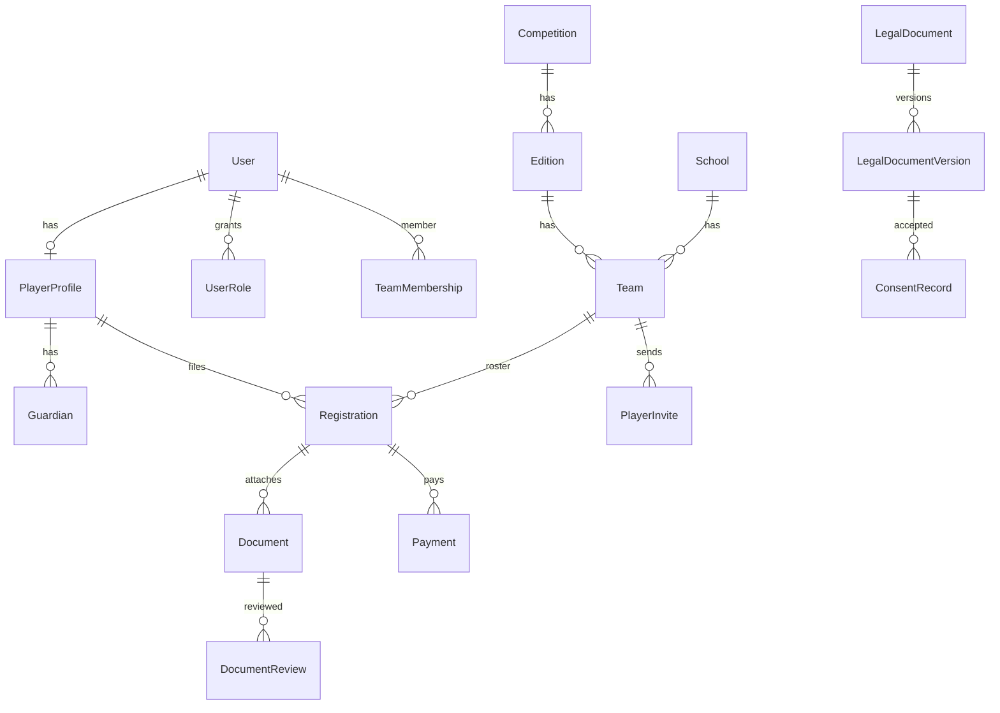

# 05 — Database Design

PostgreSQL + Prisma 7. ID stringa `cuid()`. Ogni tabella di dominio ha `createdAt` / `updatedAt`. Relazioni sempre su entrambi i lati.

I file binari **non** stanno nel database.

## 1. Diagramma logico

## 2. Auth.js

Tabelle `User`, `Account`, `Session`, `VerificationToken` secondo Auth.js Prisma adapter, estese con campi applicativi su `User` (`passwordHash`, relazioni). Non si duplica l’identità.

## 3. Identità e ruoli

**User** — account. Email unica.

**UserRole** — `role` + scope opzionale.

| role | teamId | competitionId |
|---|---|---|
| PLAYER | null (lo scope giocatore è il proprio user) | null |
| TEAM_REPRESENTATIVE | required | null |
| ORGANIZATION_ADMIN | null | null |
| SUPER_ADMIN | null | null |
| COMPETITION_ORGANIZER | null | required |

Un rappresentante che è anche giocatore ha `TEAM_REPRESENTATIVE` + membership `PLAYER` (e profilo).

**TeamMembership** — presenza nel roster: `PLAYER` | `REPRESENTATIVE`. È il fatto anagrafico di squadra; `UserRole` è l’autorizzazione.

## 4. Giocatore e tutore

**PlayerProfile** (1:1 User)

- firstName, lastName, birthDate, fiscalCode (unique, nullable finché incompleto), phone
- `metadata Json` per extra futuri
- `isMinor` **non** è persistito come fonte di verità: si calcola da `birthDate`. Si può materializzare in cache solo se documentato; in M0 si calcola.

**Guardian** (N:1 PlayerProfile)

- firstName, lastName, relationship, email, phone
- `metadata Json`
- Almeno un guardian required in applicazione se minore, non necessariamente constraint SQL (un profilo può essere salvato a metà). Unique `(playerProfileId, email)` per evitare duplicati.

## 5. Competizione e squadra

**Competition** — realtà (es. una coppa locale o un campionato). name, slug unique, description.

**Edition** — stagione/anno di una competition.

- name, year, date finestre iscrizione
- `playerFeeAmount` Decimal, `currency` default `EUR`
- `paymentMode` PLAYER | TEAM | BOTH
- `teamFeeAmount` opzionale
- `isActive`

**EditionRequirement**

- editionId, code, required boolean, appliesTo ALL|MINOR|ADULT
- unique `(editionId, code, appliesTo)`

**School** — istituto, riusabile tra edizioni. name, city, extras.

**Team** — edition + school.

- name, logoStorageKey nullable, inviteCode unique (codice squadra, oltre agli inviti singoli)
- contactName / contactEmail placeholder referente

**PlayerInvite**

- teamId, email, token hash, status PENDING|ACCEPTED|EXPIRED|REVOKED
- optional firstName, lastName precompilati
- expiresAt
- invitedByUserId

Il token in chiaro sta solo nell’URL/email; in DB si salva **hash**.

## 6. Registrazione

**Registration**

- playerProfileId, teamId, editionId
- `status` proiezione persistita per query (ricalcolata dal motore, non editata dal giocatore)
- unique `(playerProfileId, editionId)` — v1 una squadra/edizione alla volta
- submittedAt, reviewedAt nullable

Vincolo applicativo: `team.editionId === registration.editionId`.

## 7. Documenti

**DocumentType** — code (es. `MEDICAL_CERTIFICATE`), name, allowedMime[], maxSizeBytes, requiresExpiry.

**Document**

- registrationId, playerProfileId, typeId
- storageKey, mimeType, sizeBytes, checksumSha256
- originalFilename (sanitizzato)
- status UPLOADED|PENDING_REVIEW|APPROVED|REJECTED|EXPIRED|REPLACED
- uploadedAt, expiresAt, replacedById
- **nessun byte del file**

**DocumentReview**

- documentId, reviewerUserId, decision APPROVED|REJECTED, reason, createdAt

## 8. Consensi

**LegalDocument** — slug (`privacy-policy`, `media-release`, …), title, audience, requiredByDefault.

**LegalDocumentVersion** — version string/int, body (markdown/placeholder), effectiveAt, isCurrent.

**ConsentRecord**

- userId, legalDocumentVersionId, registrationId nullable
- consentType REQUIRED|OPTIONAL
- accepted (boolean: un record di rifiuto esplicito è permesso per opzionali; i required esistono solo se accepted=true)
- acceptedAt
- ipAddress, userAgent (traccia tecnica; retention OPEN_DECISIONS)
- guardianId nullable se accettazione per conto (non usato in v1 login-minore, riservato)

Mai un flag denormalizzato `privacyAccepted` sul User come unica prova.

## 9. Pagamenti

**Payment**

- registrationId nullable, teamId nullable, editionId
- amount, currency, status PENDING|SUCCEEDED|FAILED|REFUNDED
- provider (stringa libera, es. `stub`)
- providerPaymentId, providerSessionId
- paidAt, failureCode, receiptUrl nullable
- raw webhook **non** si salva intero se contiene PII; si salva event id + tipo

Check applicativo: almeno uno tra registrationId e teamId.

## 10. Notifiche e audit

**Notification** — userId, type, title, body, readAt, metadata Json (senza dati sanitari).

**AuditLog**

- actorUserId nullable (sistema)
- action (enum string: DOCUMENT_VIEW, CONSENT_ACCEPT, LOGIN, INVITE_CREATE, …)
- entityType, entityId
- metadata Json redatto
- ip, userAgent
- createdAt (no updatedAt necessario; se Prisma convention richiede updatedAt, si aggiunge)

Indici: `actorUserId`, `entityType+entityId`, `createdAt`.

## 11. Indici previsti

- User.email unique
- PlayerProfile.fiscalCode unique
- PlayerInvite.email + teamId
- Registration (playerProfileId, editionId) unique
- Registration.status
- Document.registrationId, Document.status
- Team.inviteCode unique
- ConsentRecord (userId, legalDocumentVersionId)

## 12. Cosa non sta nel DB

- File certificati
- PAN/CVV
- Password in chiaro (solo hash)
- Token invito in chiaro
- Privacy policy come unico booleano
