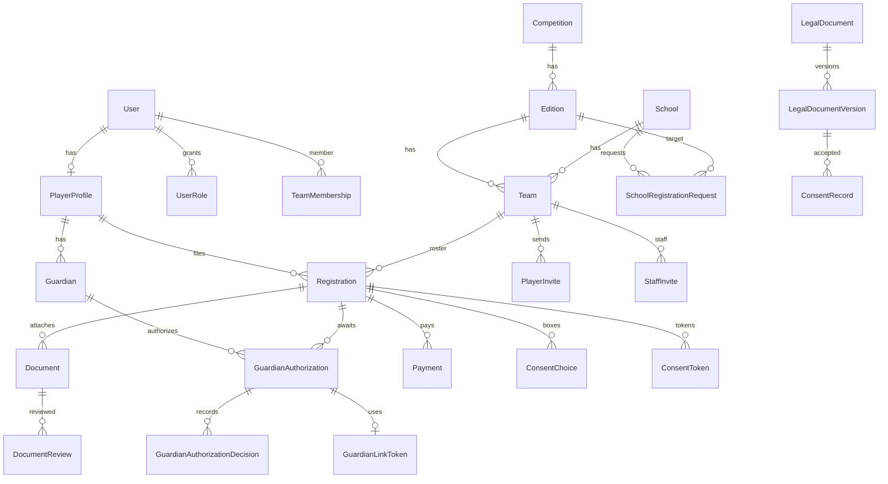

# 05 — Database Design

PostgreSQL + Prisma 7. ID stringa `cuid()`. Ogni tabella di dominio ha `createdAt` / `updatedAt`. Relazioni sempre su entrambi i lati.

I file binari **non** stanno nel database.

## 1. Diagramma logico

```mermaid
erDiagram
  User ||--o| PlayerProfile : has
  User ||--o{ UserRole : grants
  User ||--o{ TeamMembership : member
  PlayerProfile ||--o{ Guardian : has
  PlayerProfile ||--o{ Registration : files
  Guardian ||--o{ GuardianAuthorization : authorizes
  GuardianAuthorization ||--o{ GuardianAuthorizationDecision : records
  GuardianAuthorization ||--o| GuardianLinkToken : uses
  Competition ||--o{ Edition : has
  Edition ||--o{ Team : has
  School ||--o{ Team : has
  School ||--o{ SchoolRegistrationRequest : requests
  Edition ||--o{ SchoolRegistrationRequest : target
  Team ||--o{ PlayerInvite : sends
  Team ||--o{ StaffInvite : staff
  Team ||--o{ Registration : roster
  Registration ||--o{ Document : attaches
  Registration ||--o{ Payment : pays
  Registration ||--o{ GuardianAuthorization : awaits
  LegalDocument ||--o{ LegalDocumentVersion : versions
  LegalDocumentVersion ||--o{ ConsentRecord : accepted
  Registration ||--o{ ConsentChoice : boxes
  Registration ||--o{ ConsentToken : tokens
  Document ||--o{ DocumentReview : reviewed
```

## 2. Auth.js

Tabelle `User`, `Account`, `Session`, `VerificationToken` secondo Auth.js Prisma adapter, estese con campi applicativi su `User` (`passwordHash`, relazioni). Non si duplica l’identità.

## 3. Identità e ruoli

**User** — account. Email unica.

**UserRole** — `role` + scope opzionale.

| role | teamId | competitionId |
|---|---|---|
| PLAYER | null (lo scope giocatore è il proprio user) | null |
| TEAM_REPRESENTATIVE | required | null |
| ORGANIZATION_ADMIN | null | null |
| MEDICAL_REVIEWER | null | null |
| SUPER_ADMIN | null | null |
| COMPETITION_ORGANIZER | null | required |

Lo scope del rappresentante è la squadra: edizione e competition si leggono da `Team`, senza un `editionId` sul ruolo. L’organizer copre tutte le edizioni della propria competition. `ORGANIZATION_ADMIN` e `SUPER_ADMIN` restano di piattaforma (ESL/LCS), non di una singola coppa.

Un rappresentante che è anche giocatore ha `TEAM_REPRESENTATIVE` + membership `PLAYER` (e profilo).

**TeamMembership** — presenza nel roster: `PLAYER` | `REPRESENTATIVE`. È il fatto anagrafico di squadra; `UserRole` è l’autorizzazione.

## 4. Giocatore e tutore

**PlayerProfile** (1:1 User)

- firstName, lastName, birthDate, fiscalCode (unique, nullable finché incompleto), phone
- `metadata Json` per extra futuri
- `isMinor` **non** è persistito come fonte di verità: si calcola da `birthDate`. Si può materializzare in cache solo se documentato; in M0 si calcola.

**Guardian** (N:1 PlayerProfile)

- firstName, lastName, relationship, email, phone
- `kind` PRIMARY | SECONDARY
- `soleResponsibility` sul contatto primario se il minore indica unico esercente (dato, non autorizzazione)
- `metadata Json`
- Unique `(playerProfileId, email)`
- Relazioni: `GuardianAuthorization`, `GuardianLinkToken`, consensi

**GuardianAuthorization** — prova dell’intervento del genitore

- guardianId, playerProfileId, registrationId, tokenId
- status PENDING | OPENED | AUTHORIZED | REFUSED | EXPIRED | SUPERSEDED | REVOKED
- authorizationType ENROLLMENT | PUBLICATION
- requestedAt, openedAt, authorizedAt, revokedAt
- ipAddress, userAgent, legalDocumentVersionId
- Cambio genitore: nuova riga, precedente SUPERSEDED. Nessun overwrite di una riga già autorizzata.

**GuardianAuthorizationDecision** — append-only: code, accepted, clauseText, legalDocumentVersionId, createdAt

**GuardianLinkToken** — hash SHA-256, expiresAt, usedAt, purpose (AUTHORIZE | REVOKE | PUBLICATION), guardianId, playerProfileId. Plaintext solo nell’email.

## 5. Competizione e squadra

**Competition** — realtà (es. una coppa locale o un campionato). name, slug unique, description.

**Edition** — stagione/anno di una competition.

- name, year, date finestre iscrizione
- `playerFeeAmount` Decimal, `currency` default `EUR`
- `paymentMode` PLAYER | TEAM | BOTH
- `teamFeeAmount` opzionale
- `isActive`

**EditionRequirement**

- editionId, code, required boolean, appliesTo ALL|MINOR|ADULT
- unique `(editionId, code, appliesTo)`

**School** — istituto, riusabile tra edizioni. name, city, extras.

**Team** — edition + school. Una squadra senza edition non esiste. `@@unique([id, editionId])` è il bersaglio delle foreign key composte.

- name, logoStorageKey nullable, inviteCode unique (codice interno), registrationToken unique (link pubblico `/iscrizione/[token]`, uno per squadra, non per giocatore)
- contactName / contactEmail placeholder referente

**PlayerInvite** e **StaffInvite** — scope TEAM. Non hanno `editionId`: l’edizione è `team.editionId` e la competition è `team.edition.competitionId`. Il redeem usa solo il token; il client non sceglie la squadra.

- teamId, email, token hash, status PENDING|ACCEPTED|EXPIRED|REVOKED
- optional firstName, lastName precompilati
- expiresAt
- invitedByUserId

Il token in chiaro sta solo nell’URL/email; in DB si salva **hash**.

**StaffInvite** — come PlayerInvite ma per rappresentanti: teamId, email, token hash, status, expiresAt, invitedBy. Il redeem **non** crea `Registration`. Se l’email ha già un User, si aggiunge `TEAM_REPRESENTATIVE` + membership `REPRESENTATIVE`. Serve una squadra già creata.

**SchoolRegistrationRequest** — coda pubblica per una scuola non ancora in edizione. Campi: richiedente (nome, cognome, email, telefono), scuola (name, city, `schoolNameKey` normalizzato), `requesterRole` (`INSTITUTE_REPRESENTATIVE` | `TEACHER` | `OTHER`, solo dato di revisione), email istituzionale opzionale, `editionId`, status `PENDING` | `APPROVED` | `REJECTED`, `rejectionReason`, `reviewedAt`, `reviewedByUserId`. Dopo l’approvazione: `schoolId`, `teamId`, `userId`, hash del token di attivazione, scadenza, `activatedAt`. Indici unici parziali Postgres: una `PENDING` per email e una `PENDING` per (`schoolNameKey`, `editionId`). Il token in chiaro sta solo nell’URL/email. L’account approvato riceve `TEAM_REPRESENTATIVE` sullo `teamId` creato o riusato, mai ruoli di piattaforma.

## 6. Registrazione

**Registration**

- playerProfileId, teamId, editionId
- `status` proiezione persistita per query (ricalcolata dal motore, non editata dal giocatore)
- unique `(playerProfileId, editionId)` — v1 una squadra/edizione alla volta. Resta corretto: la persona non ha due partecipazioni nella stessa edizione.
- unique `(id, editionId)` — bersaglio della foreign key composta dei pagamenti
- submittedAt, reviewedAt nullable

Vincolo di database, non solo applicativo: `Registration (teamId, editionId)` → `Team (id, editionId)`. Una registrazione non può citare la squadra di un’altra edizione. `onUpdate: Restrict` impedisce di spostare la squadra di edizione lasciando le iscrizioni indietro.

## 7. Documenti

**DocumentType** — code (es. `MEDICAL_CERTIFICATE`), name, allowedMime[], maxSizeBytes, requiresExpiry.

**Document**

- registrationId, playerProfileId, typeId
- storageKey, mimeType, sizeBytes, checksumSha256
- originalFilename (sanitizzato)
- status UPLOADED|PENDING_REVIEW|APPROVED|REJECTED|EXPIRED|REPLACED
- uploadedAt, expiresAt, replacedById, blobPurgedAt
- **nessun byte del file**

**DocumentReview**

- documentId, reviewerUserId, decision APPROVED|REJECTED, reason, createdAt

## 8. Consensi

**LegalDocument** — slug (`privacy-policy`, `media-release`, …), title, audience, requiredByDefault.

**LegalDocumentVersion** — version string/int, body (markdown/placeholder), effectiveAt, isCurrent.

**ConsentRecord**

- userId, legalDocumentVersionId, registrationId nullable
- consentType REQUIRED|OPTIONAL
- accepted, acceptedAt, ipAddress, userAgent
- clauseText, actorKind USER|GUARDIAN_LINK, actorRole
- guardianId nullable: valorizzato sugli atti del link genitore

**ConsentChoice** — registro caselle (append-only)

- userId, registrationId, code (`T1`, `M1`…`M11`, `G1`…`G14`, `C1`)
- accepted, value opzionale (G3: `OTHER_PARENT` | `SOLE`)
- source (`WEB` | `GUARDIAN_LINK` | `EMAIL_C1` | `EMAIL_OPTIN` | `REVOKE` | `AREA`)
- legalDocumentVersionId, clauseText, guardianId, actorKind, actorRole, ip, userAgent, createdAt
- Nessun `updatedAt`: le revoche sono un nuovo evento

**ConsentToken** — C1 e doppio opt-in marketing (hash del token, scadenza, usedAt, reminderSentAt)

Mai un flag denormalizzato `privacyAccepted` sul User come unica prova.

## 9. Pagamenti

**Payment**

- registrationId nullable, teamId nullable, editionId
- amount, currency, status PENDING|SUCCEEDED|FAILED|REFUNDED
- provider (stringa libera, es. `stub` | `stripe`)
- providerPaymentId, providerSessionId
- paidAt, failureCode, receiptUrl nullable
- raw webhook **non** si salva intero se contiene PII; si salva event id + tipo

`editionId` resta sulla riga perché lista e copertura si filtrano per edizione. Non è una seconda fonte libera:

- quota giocatore: `registrationId` valorizzato, `teamId` nullo. FK `(registrationId, editionId)` → `Registration (id, editionId)`. In PostgreSQL, se `registrationId` è nullo il controllo non scatta.
- quota squadra: `teamId` valorizzato, `registrationId` nullo. FK `(teamId, editionId)` → `Team (id, editionId)`.
- check `registrationId IS NOT NULL OR teamId IS NOT NULL`.
- se entrambi sono valorizzati, il trigger `payment_scope_guard` esige che la registrazione appartenga a quella squadra e a quella edizione.

Documenti, consensi e token di consenso restano sulla Registration: edition e competition si raggiungono da lì, senza duplicare le FK. Notification è per utente. AuditLog è append-only (`entityType` + `entityId`), senza scope duplicato. School resta globale e riusabile tra edizioni. `Competition.parentId` è un sotto-torneo opzionale, non un’edizione.

## 10. Notifiche e audit

**Notification** — userId, type, title, body, readAt, metadata Json (senza dati sanitari).

**EmailMessage** — un destinatario per riga. `idempotencyKey` unique; purpose/templateKey; status (`QUEUED`/`SENT`/`DELIVERED`/`DELIVERY_DELAYED`/`BOUNCED`/`COMPLAINED`/`FAILED`); `userId` opzionale `onDelete: SetNull`; `recipientKind` USER/GUARDIAN; snapshot `toAddress`/`fromAddress`/`replyTo`/`subject`/`textBody` (URL con token già redatti); l’HTML si genera all’invio dal layout comune e non è persistito; provider + `providerMessageId`; errore breve; origine (`sourceEntityType`/`sourceEntityId`); `notificationId` e `actorUserId` opzionali; `queuedAt`/`sentAt`/`lastEventAt`.

**EmailEvent** — unique `(provider, providerEventId)`; type grezzo (`email.delivered`, `local.queued`, …); `occurredAt`; sommario bounce. Non si salva il JSON del webhook.

**EmailTemplateOverride** — `key` unique, subject, textBody, `updatedById`. Se manca la riga vale il template in i18n/codice.

Indici: `EmailMessage` status+queuedAt, purpose+queuedAt, userId, actorUserId, provider+providerMessageId, lastEventAt, notificationId.

**AuditLog**

- actorUserId nullable (sistema)
- actorKind USER|GUARDIAN_LINK|SYSTEM, actorRole, guardianId, authorizationId, legalDocumentVersionId
- action (enum string: DOCUMENT_VIEW, CONSENT_ACCEPT, GUARDIAN_AUTHORIZE, …)
- entityType, entityId
- metadata Json redatto
- ip, userAgent
- createdAt
- Nessuna API di update o delete. `writeAuditLog` fail-closed.

Indici: `actorUserId`, `entityType+entityId`, `createdAt`.

**RateLimitHit** — `key`, `createdAt`. Sliding window per login, inviti, upload, reset password, CSV. Non è un store in-process.

## 11. Indici previsti

- User.email unique
- PlayerProfile.fiscalCode unique
- PlayerInvite.email + teamId
- Registration (playerProfileId, editionId) unique
- Registration.status
- Document.registrationId, Document.status
- Team.inviteCode unique
- ConsentRecord (userId, legalDocumentVersionId)
- User.lifecycleStatus
- EmailMessage.idempotencyKey unique; (status, queuedAt); (purpose, queuedAt); (provider, providerMessageId)
- EmailEvent (provider, providerEventId) unique

## 12. Cosa non sta nel DB

- File certificati
- PAN/CVV
- Password in chiaro (solo hash)
- Token invito / reset password / C1 in chiaro (nello storico email restano `[link omesso]`)
- Privacy policy come unico booleano

## 13. Ciclo di vita account (non `DELETE FROM users`)

Tre operazioni distinte. Il ritiro (`WITHDRAWN`) resta un quarto stato, già esistente, e **non** equivale a togliere dalla rosa né a chiudere l’account.

**User**

- `lifecycleStatus` `ACTIVE` | `DELETED` | `ANONYMIZED` (default `ACTIVE`)
- `deletedAt`, `anonymizedAt` nullable
- Indice su `lifecycleStatus`
- La riga User **non** si cancella: FKs `Restrict` (inviti creati, review documenti) e audit lo impedirebbero in modo sicuro

**Registration.status** aggiunge `REMOVED`: rimosso dalla rosa, distinta da `WITHDRAWN`. Unique `(playerProfileId, editionId)` resta. Un re-invito sulla **stessa** squadra può riattivare la registration `REMOVED`/`WITHDRAWN`; un’altra squadra sulla stessa edizione resta conflitto v1.

| Operazione | Chi | Cosa si toglie | Cosa si tiene |
|---|---|---|---|
| `REMOVE_FROM_TEAM` | Rep del team (e staff) | `TeamMembership` PLAYER, inviti pending, visibilità rosa | Account, PII, documenti, pagamenti, consensi, audit; registration → `REMOVED` |
| `DELETE_ACCOUNT` | Super Admin | Login (password, sessioni, Account OAuth, ruoli, membership, notifiche); redazione storico email; email tombstone; iscrizioni non terminali → `REMOVED` | Riga User, PII profilo incluso CF (fino ad anonymize), Document+blob, Payment, ConsentRecord, AuditLog |
| `ANONYMIZE_ACCOUNT` | Super Admin | PII (nome, email, CF, tutore, filename, IP/UA consensi); destinatario/oggetto/corpo dello storico email; iscrizioni non terminali → `REMOVED` | Id, stati, pagamenti, blob medici (niente purge OD-030), audit |

Audit: `PLAYER_REMOVE`, `ACCOUNT_DELETE`, `ACCOUNT_ANONYMIZE`. Metadata senza CF, storageKey, motivi medici. L’audit non è cancellabile dalla UI.
